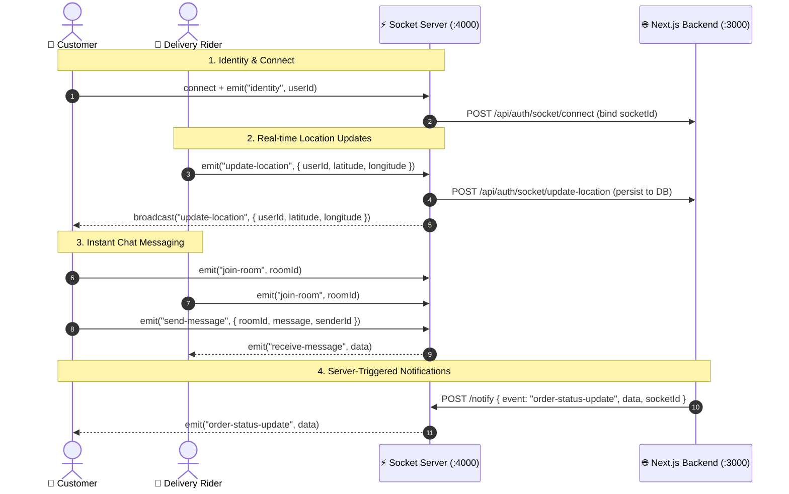

<div align="center">

# ⚡ SnapCart — Real-Time WebSocket Microservice

[](https://nodejs.org/)
[](https://expressjs.com/)
[](https://socket.io/)
[](https://developer.mozilla.org/en-US/docs/Web/HTTP/CORS)

The dedicated, ultra-low latency real-time communication server powering **SnapCart**'s live GPS delivery tracking, buyer-driver chat messaging, and instantaneous event push notifications.

[Features](#-key-features) • [Architecture](#-how-it-works) • [Event Reference](#-websocket-event-reference) • [HTTP API](#-http-webhook-api) • [Getting Started](#-getting-started)

</div>

---

## ⚡ Key Features

- **📍 High-Frequency Live GPS Location Streaming**: Relays real-time latitude/longitude coordinates between delivery riders and customer live maps.
- **💬 Direct Buyer-Driver Chat Rooms**: Supports dynamic room-based message routing (`join-room`, `send-message`, `receive-message`).
- **🔔 HTTP `/notify` Webhook Endpoint**: Allows the Next.js API server to push real-time events (order placed, driver assigned, order status changed) to connected clients without keeping socket instances on serverless functions.
- **🔗 Client Identity & Session Sync**: Associates incoming socket IDs with authenticated user IDs on the Next.js backend.
- **🛡️ Secure CORS & Credentials**: Built-in credentialed CORS support configured for Next.js web clients.

---

## 🏛 How It Works



---

## 📡 WebSocket Event Reference

### Client-to-Server (`socket.on`)

| Event | Payload | Description |
|---|---|---|
| `identity` | `userId: string` | Registers the socket with the user's account and updates the backend. |
| `update-location` | `{ userId: string, latitude: number, longitude: number }` | Emits live GPS coordinates to tracking maps and updates MongoDB geospatial coordinates. |
| `join-room` | `roomId: string` | Subscribes the socket connection to a dedicated chat room. |
| `send-message` | `{ roomId: string, ...messageData }` | Relays an in-app message to room participants or broadcasts to listeners. |

### Server-to-Client (`socket.emit` / `io.emit`)

| Event | Payload | Target | Description |
|---|---|---|---|
| `update-location` | `{ userId, latitude, longitude }` | All clients | Streams live agent location to map views. |
| `receive-message` | `MessageObject` | Room members | Delivers new chat messages in real time. |
| `new-order` | `OrderObject` | Admins | Notifies admins when a new order is submitted. |
| `new-assignment` | `AssignmentObject` | Delivery Boys | Broadcasts proximity delivery requests to active riders. |
| `order-status-update` | `{ orderId, status, isPaid }` | Specific / All | Updates order progress badge across portals. |

---

## 🔌 HTTP Webhook API

### `POST /notify`
Enables Next.js server actions and API routes to emit socket events across the network.

**Headers:**
```http
Content-Type: application/json
```

**Request Body:**
```json
{
  "event": "order-status-update",
  "data": {
    "orderId": "65b1c2d3...",
    "status": "out_for_delivery"
  },
  "socketId": "optional_target_socket_id"
}
```

**Response:**
```json
{
  "success": true,
  "message": "Notification sent successfully"
}
```

---

## 🚀 Getting Started

### 1. Prerequisites
- **Node.js** v18+ or v20+
- **npm** or **yarn**

### 2. Installation
```bash
cd socketServer
npm install
```

### 3. Environment Variables
Create a `.env` file in the `socketServer` directory:

```env
PORT=4000
NEXT_BASE_URL=http://localhost:3000
```

### 4. Running the Server

**Development mode (with auto-reload):**
```bash
npm run dev
```

**Production mode:**
```bash
node index.js
```

---

## 👨‍💻 Author

Part of the **[SnapCart Ecosystem](https://github.com/akashsingh062/snapcart)** by **[Akash Singh](https://github.com/akashsingh062)**.
